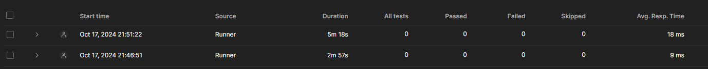

# ArticleApp - .NET Приложение с Redis и PostgreSQL

Это проект демонстрирует разницу в производительности между прямыми запросами к базе данных PostgreSQL и использованием Redis для кэширования. Приложение позволяет запрашивать данные статей из базы данных, а с помощью Redis повторные запросы могут обрабатываться значительно быстрее.

## Описание

В приложении можно запросить статью по ID или получить случайную статью. Кэширование в Redis используется для хранения результатов предыдущих запросов, что позволяет ускорить последующие запросы.

### Производительность Redis

Ниже приведено изображение, демонстрирующее результат тестирования, где Redis показал в **2 раза быстрее** обработку запросов по сравнению с обычными запросами к базе данных.

## Эндпоинты

- **GET /Articles/randomArticle**: Возвращает случайную статью из базы данных или кэша.
- **GET /Articles/article/{id}**: Получает статью по идентификатору (ID) из базы данных или кэша.

## Запуск проекта

Следуйте этим шагам для запуска проекта локально с использованием Docker, PostgreSQL и Redis.

### 1. Запуск базы данных PostgreSQL

Чтобы запустить базу данных PostgreSQL, используйте следующую команду для выполнения Docker Compose конфигурации, которая настроит базу данных с заранее подготовленными данными:

<pre>
<code>
docker-compose up --build
</code>
</pre>

Эта команда создаст и инициализирует базу данных PostgreSQL в соответствии с описанием в файлах <code>docker-compose.yml</code> и <code>init.sql</code>.

<h3>2. Запуск Redis</h3>

Далее, нужно запустить контейнер Redis. Приложение ожидает, что Redis будет работать под именем контейнера <code>redis-cache</code>. Чтобы запустить Redis с помощью Docker, выполните:

<pre>
<code>
docker run -d --name redis -p 6379:6379 redis
</code>
</pre>

Эта команда запустит Redis и откроет порт 6379 для локального доступа.

<h3>3. Запуск .NET приложения</h3>

Когда база данных и Redis запущены, можно запустить .NET приложение с помощью команды:

<pre>
<code>
cd ArticleApp
dotnet run
</code>
</pre>

<h3>4. Проверка работы приложения</h3>

Вы можете проверить работу приложения, перейдя по адресу Swagger документации:

<pre>
<code>
http://localhost:5001/swagger
</code>
</pre>

Либо можете выполнить следующие API-запросы с помощью Postman или <code>curl</code>:

<ul>
  <li><strong>Получить случайную статью</strong>:
    <pre><code>curl http://localhost:5000/Articles/randomArticle</code></pre>
  </li>
  <li><strong>Получить статью по ID (замените <code>{id}</code> на нужный номер)</strong>:
    <pre><code>curl http://localhost:5000/Articles/article/{id}</code></pre>
  </li>
</ul>

<h3>Заключение</h3>

С включенным кэшированием Redis повторные запросы на получение одних и тех же данных будут обслуживаться значительно быстрее по сравнению с прямыми запросами к базе данных PostgreSQL. Это улучшает общую производительность приложения и снижает нагрузку на базу данных.

